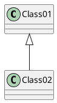

> **Мова / Language:** Українська | [English](../md/mdsupport.md)

# Підтримка Markdown

Codimension використовує markdown для власної документації. Також пропонуються
можливості застосування markdown для документування проєктів користувачів.

**Реалізація (форк, 2026):** [mistune](https://github.com/lepture/mistune) **3.x** (`codimension/utils/md.py`, `mistune>=3.2.1` у requirements.txt). API: `create_markdown()` + власний `HTMLRenderer`.

Для цих цілей реалізовано:

* Розпізнавання типу файлу markdown
* Рендерер markdown для редагування та перегляду markdown-файлів
* Властивість проєкту, що вказує стартову сторінку документації проєкту

Можливості рендерингу базуються (і відповідно обмежені) кількома компонентами:

* [Mistune](https://github.com/lepture/mistune) — markdown-парсер на чистому
  Python. Також рендерить вихідний текст у HTML
* [Pygments](http://pygments.org/) — Python-бібліотека для підсвічування
  фрагментів коду в документації
* Віджет QT [QTextBrowser](https://doc.qt.io/Qt-5/qtextbrowser.html)
  для відображення згенерованого HTML. Віджет має суттєві обмеження щодо HTML,
  тому відображений текст не завжди ідеальний.

## Діалект Markdown

Підтримуваний діалект визначається тим, що розпізнає mistune і що
додає Codimension. Нижче позначено, що саме додано Codimension.

### Заголовки

```markdown
# Заголовок один
## Заголовок два
### Заголовок три
...
```

або

```markdown
Заголовок один
===============

Заголовок два
-----------
```

### Нагадування (emphasis)

| Позначення | Результат |
| --------- | -------- |
| \*Курсив* | *Курсив* |
| \_Курсив_ | _Курсив_ |
| \**Жирний** | **Жирний** |
| \__Жирний__ | __Жирний__ |

### Горизонтальна лінія

```markdown
---
***
___
```

### Блок коду

Codimension намагається знайти лексер для блоку коду двома спробами.
Якщо вказано назву мови — вона використовується для вибору лексера. Інакше
бібліотека magic робить найкраще припущення щодо MIME-типу коду.

Код у зворотних лапках:

    ```python
    # блок коду
    print('3 backticks or')
    print('indent 4 spaces')
    ```

буде відображено як:

```python
# блок коду
print('3 backticks or')
print('indent 4 spaces')
```

Код з відступом:

    # блок коду
    print('3 backticks or')
    print('indent 4 spaces')

буде відображено як:

    # блок коду
    print('3 backticks or')
    print('indent 4 spaces')

### Inline-код

| Позначення | Результат |
| -------------------------------- | ------------------------------- |
| Inline \`keyword` підсвічено | Inline `keyword` підсвічено |

### Підтримка UML-діаграм

Codimension використовує PlantUML ([http://plantuml.com](http://plantuml.com)) для
відображення всіх підтримуваних PlantUML діаграм у документації. Для цього вкажіть
мову `plantuml` у блоці коду:

    ```plantuml
    @startuml
    Class01 <|-- Class02
    @enduml
    ```

Буде відображено як:



Можливі пари тегів початку/кінця:

* @startuml / @enduml
* @startgantt / @endgantt
* @startsalt / @endsalt
* @startmindmap / @endmindmap
* @startwbs / @endwbs
* @startditaa / @endditaa
* @startjcckit / @endjcckit

PlantUML може розширити список у майбутньому — дивіться їхній сайт для
повної специфікації мови.

### Цитата (block quote)

Позначення на кшталт

    > Цитата
    > другий рядок
    >
    >> вкладений рівень
    >>> ще глибший рівень
    >>> текст продовжується

буде відображено як:

> Цитата
> другий рядок
>
>> вкладений рівень
>>> ще глибший рівень
>>> текст продовжується

### Списки

Елементи ненумерованого списку можуть використовувати символи '-', '+' та '*'.

    * Список 1
        * Список 11
            * Список 111

буде відображено як:

* Список 1
  * Список 11
    * Список 111

    1. Один
    2. Два
    3. Три

буде відображено як:

1. Один
2. Два
3. Три

### Таблиця

    | Вирівнювання за замовчуванням | По центру | Зліва | Справа |
    | ------------------------ |:-----------------------:|:----------------------|-----------------------:|
    | За замовчуванням        | По центру        | Зліва        | Справа        |

буде відображено як:

| Вирівнювання за замовчуванням | По центру | Зліва | Справа |
| ------------------------ |:-----------------------:|:----------------------|-----------------------:|
| За замовчуванням        | По центру        | Зліва        | Справа        |

### Посилання

```markdown
[Посилання на щось](http://a.com)
```

буде відображено як:

[Посилання на щось](http://a.com)

```markdown
[Посилання з URL пізніше][1]
[1]: http://b.org
```

буде відображено як:

[Посилання з URL пізніше][1]
[1]: http://b.org

Codimension розширює формат посилань так:

* якщо використано схему http або https — викликається зовнішній браузер
* інакше посилання трактується як файл з необов'язковим номером рядка

| Формат посилання |
| ----------- |
| file:./relative/fname[#anchorOrLine] |
| file:relative/fname[#anchorOrLine] |
| file:/absolute/fname[#anchorOrLine] |
| file:///absolute/fname[#anchorOrLine] |
| relative/fname[#anchorOrLine] |
| /absolute/fname[#anchorOrLine] |

Необов'язковий параметр anchorOrLine — ідентифікатор якоря з CML doc
коментаря або номер рядка. При кліку відкривається відповідний файл,
Codimension спочатку намагається трактувати позицію як CML doc anchor, а
якщо не знайдено — як номер рядка. Якщо знайдено — файл прокручується
відповідно.

Якір має відповідати правилу: [_a-zA-Z0-9]+

### Зображення

Підтримуються pixmap як:

* локальний абсолютний шлях
* локальний відносний шлях
* веб-ресурс

Приклади:

```markdown


```

Для веб-ресурсів є кеш завантажених елементів. Кеш
прив'язаний до IDE і розташований у `~/.codimension3/webresourcecache/`. Кеш
автоматично очищується при старті IDE — файли старші за 24 години видаляються.
